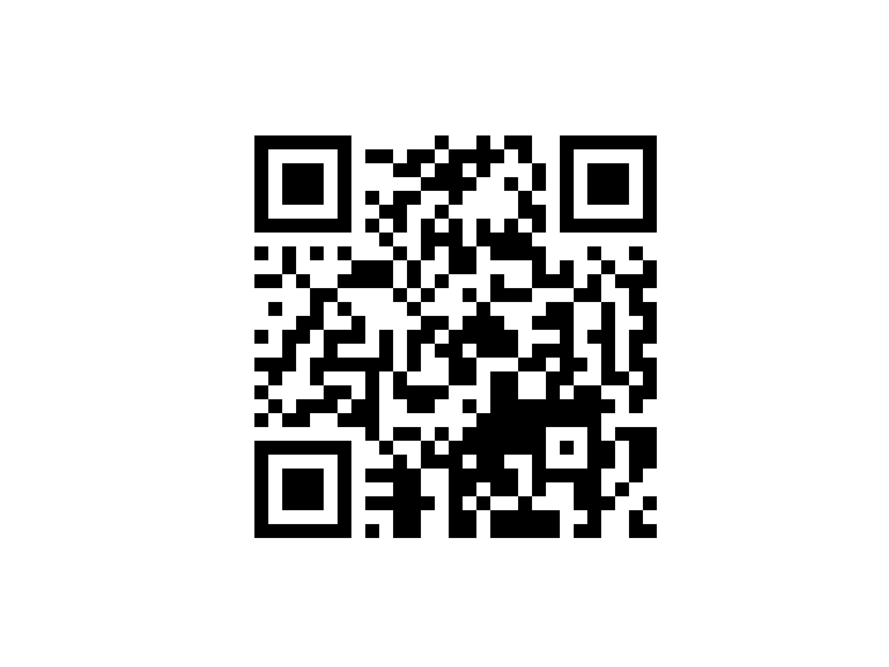

# CS258 final project
Although some of these codes are referred to some repository (including Error Correction Codeword generation and GF feild convertion calculation), I completed most of work.

## Thought of Design
1. determine a suitable version for input text
2. determine a suitable mask pattern for least lost points
3. fill function pattern (including timeline, format information, etc)
4. rearange data and generate error correction codewords by other repositories.
5. compose both and fill this part by Z shape.
6. (optional) show the matrix by matplotlib

## Usage
Samples are like this:
```python
import QRcode
q = QRcode.QrCode()
q.add_data("Finally finished CS258 project!!!")
q.make()
q.display()
```

And such a QRcode will be generated:

